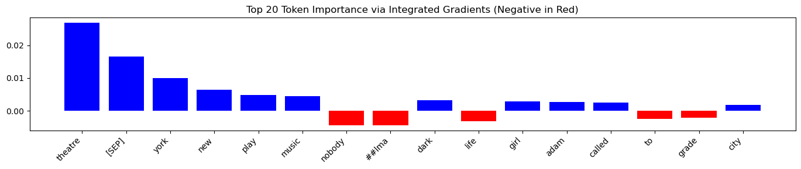
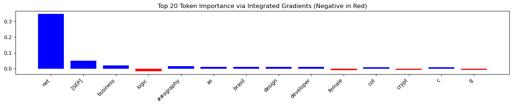

# Explaining Resume Classification with Integrated Gradients

**Authors**: Natalia Agapova, Andrew Levada  
**Date**: April 24, 2025

---

## Introduction

Large Language Models (LLMs) have transformed how companies handle Human Resources (HR) tasks, especially resume classification. These models help HR teams sort through large numbers of job applications quickly. However, this automation raises important ethical questions. The models might show bias when they rely on personal details like name, gender, or location to make decisions.

In this project, we use the **Integrated Gradients (IG)** method to understand how a resume classification model makes its decisions. Our goal is to find any unfair patterns in how the model works and make its decision process clear.

---

## Application Domain

**Domain**: Human Resources automation — resume classification  
**Importance**: Biased algorithms can harm people's chances to get jobs

Companies now receive hundreds or thousands of applications for each job. Manual review of all these resumes is not practical. Automated systems help manage this workload, but they need careful checks to make sure they don't repeat or increase existing biases in hiring.

---

## Model Description

We use the publicly available model [`bert-resume-classification`](https://huggingface.co/ahmedheakl/bert-resume-classification), which implementation and results are described in the [paper](https://arxiv.org/html/2406.18125v1). The model was trained on the [`resume-atlas`](https://huggingface.co/datasets/ahmedheakl/resume-atlas) dataset, which contains over 13,000 professionally written resumes across 43 different job categories.

- **Type**: Text-to-text model
- **Architecture**: BERT-based transformer model
- **Training Data**: Large collection of professional resumes from resume-atlas dataset
- **Output**: Classification of resumes into job categories
- **Input Processing**: Breaks down resume text into tokens while keeping context

The model works with resumes as sequences of tokens. Each token represents a word or part of a word. It uses BERT's attention system to understand how different parts of the resume connect and make classification decisions based on the whole context.

## Explainability Method: Integrated Gradients

Integrated Gradients (IG) is a method that shows which parts of the input matter most for the model's decision. It does this by comparing the input to a baseline and measuring how changes affect the output.

### Mathematical Foundation

The Integrated Gradients method follows these rules:

1. **Path Integration**: It measures changes along a path from a baseline to the actual input
2. **Completeness**: The total of all attributions equals the difference between the model's output for the actual input and the baseline
3. **Sensitivity**: Any feature that changes the prediction must get some attribution

### Implementation Steps:

1. **Baseline Selection**: Pick a baseline input (like an empty string) that means "no information"
2. **Input Encoding**: Convert both baseline and actual input into tokens
3. **Gradient Computation**:
   - Create steps between baseline and actual input
   - Measure how the model's output changes at each step
4. **Attribution Calculation**:
   - Add up the changes along the path
   - Get final scores for each token
5. **Visualization**: Show the scores in barplots or heatmaps

### Advantages of IG:

- **Theoretical Soundness**: Based on solid math
- **Implementation Independence**: Works with any model that can calculate gradients
- **Sensitivity**: Shows both helpful and harmful contributions
- **Completeness**: Scores add up to the total change in prediction

---

## Token Attribution Example

Given the input:

> "Senior Java developer with 10+ years experience in backend systems, cloud, and microservices."

We calculated token attributions with IG. The visualization (see below) shows which tokens had the most influence on the model's decision.


The visualization shows these key points:

1. Technical words like "Java", "backend", and "microservices" got high positive scores
2. Experience details ("10+ years") had strong importance
3. Job level ("Senior") helped the classification
4. Common words got low scores, as expected

### Implementation Code

Here's the Python code we used to implement the Integrated Gradients analysis:

```python
from transformers import AutoTokenizer, AutoModelForSequenceClassification
import torch
from captum.attr import IntegratedGradients
import matplotlib.pyplot as plt
device = "cpu" if not torch.cuda.is_available() else "cuda"

# Load the BERT model for resume classification
adapter_model_id = "ahmedheakl/bert-resume-classification"
tokenizer = AutoTokenizer.from_pretrained(adapter_model_id, device=device)
model = AutoModelForSequenceClassification.from_pretrained(adapter_model_id)
model.eval()

def draw_attributions(attributions, input_ids, fig_number):
    # Process attribution scores and create visualization
    token_attributions = attributions.sum(dim=-1).squeeze().detach().numpy()
    tokens = tokenizer.convert_ids_to_tokens(input_ids[0])

    # Get top 20 most important tokens
    token_attr_pairs = list(zip(tokens, token_attr_pairs))
    token_attr_pairs.sort(key=lambda x: abs(x[1]), reverse=True)
    top_20_pairs = token_attr_pairs[:20]
    top_tokens, top_attributions = zip(*top_20_pairs)

    # Create and save the visualization
    plt.figure(figsize=(14, 3))
    plt.bar(top_tokens, top_attributions)
    plt.xticks(rotation=45, ha="right")
    plt.title("Top 20 Token Importance via Integrated Gradients")
    plt.tight_layout()
    plt.savefig(f"example{fig_number}.png", bbox_inches='tight')
    plt.show()

def test_sample(input_text, ig):
    # Process input text and compute attributions
    input_ids = get_input_ids(input_text)
    baseline_ids = get_baseline_ids(input_ids)

    input_embeds = ids_to_embeddings(input_ids)
    baseline_embeds = ids_to_embeddings(baseline_ids)

    attributions, _ = ig.attribute(
        inputs=input_embeds,
        baselines=baseline_embeds,
        return_convergence_delta=True
    )

    return attributions, input_ids

# Helper functions for text processing
def get_input_ids(input_text):
    inputs = tokenizer(input_text, return_tensors="pt", padding=True)
    return inputs["input_ids"]

def get_baseline_ids(reference_ids):
    inputs = tokenizer("", return_tensors="pt", padding="max_length",
                      max_length=reference_ids.shape[1])
    return inputs["input_ids"]

def ids_to_embeddings(input_ids):
    return model.get_input_embeddings()(input_ids).requires_grad_(True)

def forward_from_embeddings(input_embeds):
    output = model(inputs_embeds=input_embeds)
    logits = output.logits
    return torch.softmax(logits, dim=1)[:, 1]

# Sample texts for analysis
gender_marked_texts = [
    "Senior Java developer with 10+ years experience in backend systems, cloud, and microservices.",
    # Additional resume samples...
]

# Run analysis on each sample
ig = IntegratedGradients(forward_from_embeddings)
for i, text in enumerate(gender_marked_texts):
    print(text)
    attributions, input_ids = test_sample(text, ig)
    draw_attributions(attributions, input_ids, i)
```

This code:

1. Loads the BERT model for resume classification
2. Implements Integrated Gradients analysis
3. Processes input text and computes token attributions
4. Creates visualizations of the most important tokens
5. Runs the analysis on sample resumes

The code uses the Captum library for Integrated Gradients and PyTorch for model operations. The visualizations help us understand which parts of the resume most influence the model's decisions.

---

## Bias Evaluation

We tested the model with different types of resumes from the [`resume-atlas`](https://huggingface.co/datasets/ahmedheakl/resume-atlas) dataset, which contains over 13,000 professionally written resumes across 43 different job categories. Our analysis focused on:

- Names that suggest different genders
- Different locations (cities vs. rural areas, different countries)
- Different types of schools
- Different career paths

Integrated Gradients helped us see if personal details affected the model's decisions. Sometimes, these details had more influence than they should, which could mean bias.

### Detailed Bias Analysis

We looked at three main types of potential bias:

1. **Name-based Bias**:

   - Compare scores for names that suggest male vs. female
   - Check if name origin affects the decision
   - See how much names matter in the final choice

2. **Location-based Bias**:

   - Look at how location details affect the score
   - Compare urban vs. rural location impact
   - Check if international experience matters more or less

3. **Experience Pattern Bias**:
   - Look at how career paths affect the score
   - Check if employment gaps change the result
   - See if non-standard career paths get lower scores

### Examples of Bias Evaluation

We used Integrated Gradients on samples from the original dataset to see how personal details might affect the results.

**Sample 1:**

This sample shows that irrelevant information influences the model's response.

**Sample 2:**

Here, location details had influence.

**Sample 3:**

This sample shows that school background had too much influence.

The results are complex. Some patterns suggest bias, but the link between personal details and model decisions is not always clear. This shows why we need careful analysis and regular checks of automated resume systems.

---

## Implications and Recommendations

Our findings have important effects on how companies should use automated resume screening:

1. **Transparency Requirements**:

   - Keep detailed records of how the model works
   - Check for bias regularly
   - Make the decision process clear to applicants

2. **Model Improvement**:

   - Add fairness rules during training
   - Use diverse training data
   - Update the model when bias is found

3. **Operational Guidelines**:
   - Keep human review for important decisions
   - Have clear rules for special cases
   - Review results regularly

---

## Future Work

We suggest these areas for future research:

1. Better ways to find bias
2. Standard tests for fairness in resume screening
3. Study of how different types of bias work together
4. New ways to reduce bias automatically

---

## Conclusion

This project shows how Integrated Gradients can help us understand resume classification models. Our detailed study shows how technical skills, job experience, and sometimes personal details affect the results. This work highlights both the benefits and challenges of using AI in hiring.

For HR teams, tools like IG are essential to make sure the process is fair and clear. But they need to be part of a complete approach that includes:

- Regular bias checks
- Human review
- Clear records
- Constant improvement

When we combine technical solutions with ethical care, we can build better automated resume screening systems.

---

## Links

- **Code repository**: [Github](https://github.com/natagapova/xai-resume-bias)
- **Method paper**: [Integrated Gradients (Sundararajan et al., 2017)](https://arxiv.org/abs/1703.01365)
