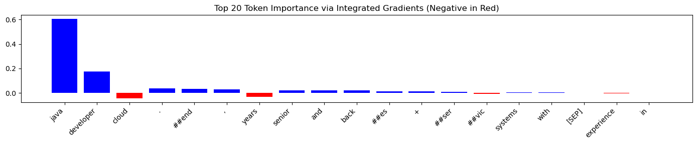
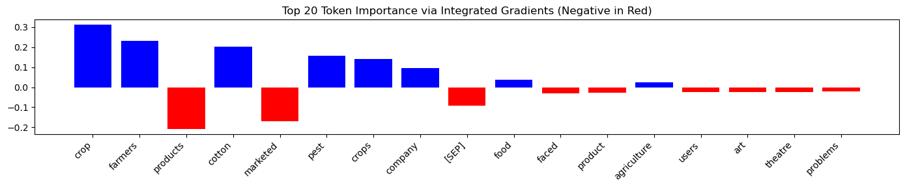
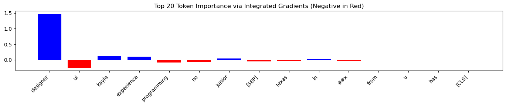
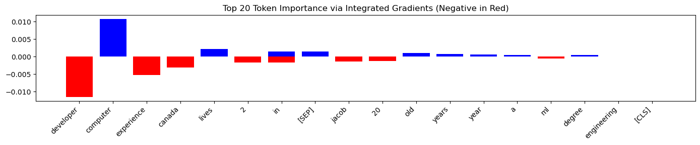

# Explaining Resume Classification with Integrated Gradients

**Authors**: Natalia Agapova, Andrew Levada  
**Date**: April 24, 2025

---

## Introduction

Large Language Models (LLMs) have transformed how companies handle Human Resources (HR) tasks, especially resume classification. These models help HR teams sort through large numbers of job applications quickly. However, this automation raises important ethical questions. The models might show bias when they rely on personal details like name, gender, or location to make decisions.

In this project, we use the **Integrated Gradients (IG)** method to understand how a resume classification model makes its decisions. Our goal is to find any unfair patterns in how the model works and make its decision process clear.

---

## Application Domain

**Domain**: Human Resources automation — resume classification  
**Importance**: Biased algorithms can harm people's chances to get jobs

Companies now receive hundreds or thousands of applications for each job. Manual review of all these resumes is not practical. Automated systems help manage this workload, but they need careful checks to make sure they don't repeat or increase existing biases in hiring.

---

## Model Description

We use the publicly available model [`bert-resume-classification`](https://huggingface.co/ahmedheakl/bert-resume-classification), which was implemented in the [paper](https://arxiv.org/html/2406.18125v1) we have found. The model was trained on the [`resume-atlas`](https://huggingface.co/datasets/ahmedheakl/resume-atlas) dataset, which contains over 13,000 professionally written resumes across 43 different job categories parsed from LinkedIn.

The model takes the heavily preprocessed text of the resume and classifies it into one of the 43 job classes. This model can be used by recruitment automation systems to filter out the resumes that do not seem to be relevant to the job opening.

- **Type**: Text-to-class model
- **Architecture**: BERT-based transformer model
- **Training Data**: Large collection of professional resumes from resume-atlas dataset
- **Output**: Classification of resumes into job categories
- **Input Processing**: Breaks down resume text into tokens (with nltk) while keeping context

The model works with resumes as sequences of tokens. Each token represents a word or part of a word. It uses BERT's attention system to understand how different parts of the resume connect and make classification decisions based on the whole context.

## Explainability Method: Integrated Gradients

Integrated Gradients (IG) is a method that shows which parts of the input matter most for the model's decision. It does this by comparing the input to a baseline and measuring how changes affect the output.

### Mathematical Foundation

The Integrated Gradients method follows 3 key rules:

1. **Path Integration**: It measures changes along a path from a baseline to the actual input
2. **Completeness**: The total of all attributions equals the difference between the model's output for the actual input and the baseline
3. **Sensitivity**: Any feature that changes the prediction must get some attribution

The formula for Integrated Gradients is:  
$IG(x, x') = (x - x') \cdot \int_{\alpha=0}^{1} \nabla F(x' + \alpha(x - x')) d\alpha$

Where:

- *x* = your actual input (e.g., embedded resume text),
- *x'* = the baseline (e.g., all-zero embedding or [PAD]),
- *F()* = your model's output function (e.g., logits for a class),
- *∇F(...)* = the gradient of the output with respect to the input,
- *α* = interpolation scalar from 0 to 1.

### Implementation Steps:

1. **Baseline Selection**: Pick a baseline input (like an empty string) that means "no information"
2. **Input Encoding**: Convert both baseline and actual input into tokens and then into embeddings
3. **Gradient Computation**:
   - Create steps between baseline and actual input
   - Measure how the model's output changes at each step
4. **Attribution Calculation**:
   - Add up the changes along the path
   - Get final scores for each token
5. **Visualization**: Show the scores of top features (tokens) in barplots

### Advantages of IG:

- **Theoretical Soundness**: Based on solid math
- **Implementation Independence**: Works with any model that can calculate gradients
- **Sensitivity**: Shows both helpful and harmful contributions
- **Completeness**: Scores add up to the total change in prediction

---

## Token Attribution Example

Given the input (human-readable and not pre-processed just as an example):

> "Senior Java developer with 10+ years experience in backend systems, cloud, and microservices."

We calculated token attributions with IG. The visualization (see below) shows which tokens had the most influence on the model's decision.

The visualization shows these key points:

1. Technical words like "Java", "developer", and "##end" (for backend?) got high positive scores
2. Experience details ("10+ years") had low importance
3. Common words got low scores, as expected

### Implementation

Our approach is straightforward:

1. Loads the BERT model for resume classification and original dataset for labels
2. Implements Integrated Gradients analysis
3. Processes input text and computes token attributions
4. Creates visualizations of the most important tokens
5. Runs the analysis on sample resumes

The code uses the Captum library for Integrated Gradients and PyTorch for model operations. The visualizations help us understand which parts of the resume most influence the model's decisions.

---

## Bias Evaluation

We tested the model with different types of resumes from the [`resume-atlas`](https://huggingface.co/datasets/ahmedheakl/resume-atlas) dataset, which contains over 13,000 professionally written resumes across 43 different job categories. Our analysis focused on:

- Names that suggest different genders
- Different locations (cities vs. rural areas, different countries)
- Different types of schools
- Different career paths

Integrated Gradients helped us see if personal details affected the model's decisions. Sometimes, these details had more influence than they should, which could mean bias.

### Detailed Bias Analysis

We looked at three main types of potential bias:

1. **Name-based Bias**:

   - Compare scores for names that suggest male vs. female
   - Check if name origin affects the decision
   - See how much names matter in the final choice

2. **Location-based Bias**:

   - Look at how location details affect the score
   - Compare urban vs. rural location impact
   - Check if international experience matters more or less

3. **Experience Pattern Bias**:
   - Look at how career paths affect the score
   - Check if employment gaps change the result
   - See if non-standard career paths get lower scores

### Examples of Bias Evaluation

We used Integrated Gradients on samples from the original dataset to see how personal details might affect the results.

**Sample 1 (Arts):**

For this "Arts" category resume, the model correctly focused on relevant keywords like "theater," "play," and "music." However, it showed a strong preference for the location "New York" and potentially favored "girl", indicating possible location and gender bias.

**Sample 2 (DotNet Developer):**

In this resume for a '.NET Developer', the model correctly identified technical skills like '.net'. However, it assigned negative importance to the token 'female' and positive importance to 'brasil', suggesting potential gender and location biases.

**Sample 3 (Agriculture):**

For this "Agriculture" resume, the model appropriately focused on a variety of professional terms. The attribution scores are distributed logically across relevant skills and experiences, without showing significant weight on potentially sensitive attributes like name or location in this instance.

**Sample 4 (Designing. Synthetic):**

The model demonstrated a strong focus on the term 'designer', possibly overshadowing other qualifications. A small negative attribution was assigned to the location 'texas', suggesting a potential bias against this region.

**Sample 5 (Data Science, Synthetic):**

For this 'Data Science' resume, the model focused well on relevant skills but showed a strong negative bias against the location 'canada'.

### Summary of Findings from Examples

Based on the Integrated Gradients analysis of these samples, several patterns emerge:

- **Location Bias**: A recurring observation is the significant attribution score assigned to location tokens (e.g., "New York", "brasil", "texas", "canada") across different job categories. This suggests the model may have learned spurious correlations between geographical locations and job roles, potentially leading to biased outcomes. The consistency of this finding across multiple examples points towards a systemic issue.
- **Keyword Overfitting**: In some cases, like the "Designing" resume (Sample 4), the model appears to heavily rely on a single keyword ("designer"). While relevant, this intense focus might indicate overfitting, where the model prioritizes specific terms over a holistic assessment of the candidate's profile.
- **Inconclusive Evidence for Other Biases**: While some examples showed potential gender bias (e.g., negative attribution for "female" in Sample 2, positive for "girl" in Sample 1), the evidence across the limited set of samples isn't as consistently strong or clear-cut as the location bias. Further investigation with a larger, more diverse set of resumes would be needed to draw firm conclusions about name or gender biases.

These examples highlight how IG can pinpoint specific tokens influencing the model's decision, revealing potentially problematic patterns that warrant further investigation and mitigation.

---

## Conclusion

This project shows how Integrated Gradients can help us understand resume classification models. Our detailed study shows how technical skills, job experience, and sometimes personal details affect the results. This work highlights both the benefits and challenges of using AI in hiring.

For HR teams, tools like IG are essential to make sure the process is fair and clear. But they need to be part of a complete approach that includes:

- Regular bias checks
- Human review
- Clear records
- Constant improvement

When we combine technical solutions with ethical care, we can build better automated resume screening systems.

---

## Links

- **Code repository**: [Github](https://github.com/natagapova/xai-resume-bias)
- **Method paper**: [Integrated Gradients (Sundararajan et al., 2017)](https://arxiv.org/abs/1703.01365)
